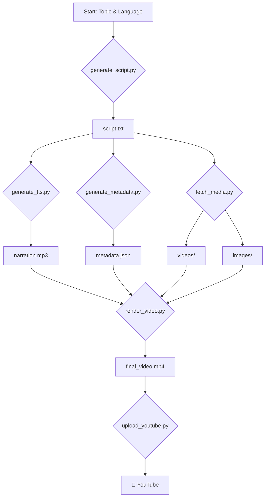

# 🏛️ Arquitetura do Pipeline - The Lost Archives

Este documento detalha a arquitetura do pipeline de geração de vídeo do projeto "The Lost Archives".

## Visão Geral

O projeto utiliza uma arquitetura baseada em micro-serviços orquestrados por um fluxo principal, que pode ser executado localmente ou em um ambiente de nuvem (Cloud Run). Cada etapa do processo é encapsulada em um script Python independente, garantindo modularidade e fácil manutenção.

## Diagrama do Fluxo

## Componentes

### 1. **`generate_script.py`**
- **Responsabilidade:** Criar o roteiro do vídeo.
- **Input:** Tópico e idioma.
- **Processo:**
    1. Conecta-se à API do **Google Gemini**.
    2. Utiliza um prompt pré-definido para solicitar um roteiro sobre o tópico fornecido, estruturado para narração.
    3. Salva o roteiro gerado em `script.txt`.
- **Output:** `script.txt`

### 2. **`generate_tts.py`**
- **Responsabilidade:** Converter o roteiro em áudio de narração.
- **Input:** `script.txt` e idioma.
- **Processo:**
    1. Lê o conteúdo do `script.txt`.
    2. Conecta-se à API do **Google Cloud Text-to-Speech (TTS)**.
    3. Seleciona uma voz neural com base no idioma e nas configurações (`voices.yaml`).
    4. Converte o texto em áudio.
- **Output:** `narration.mp3`

### 3. **`generate_metadata.py`**
- **Responsabilidade:** Criar metadados para o vídeo do YouTube.
- **Input:** Tópico e `script.txt`.
- **Processo:**
    1. Conecta-se à API do **Google Gemini**.
    2. Envia o tópico e o roteiro para gerar:
        - Títulos (3 variações para A/B testing)
        - Descrição otimizada para SEO
        - Tags relevantes
    3. Formata a saída em JSON.
- **Output:** `metadata.json`

### 4. **`fetch_media.py`**
- **Responsabilidade:** Baixar vídeos e imagens de stock.
- **Input:** `script.txt` (para extrair palavras-chave).
- **Processo:**
    1. Analisa o `script.txt` para identificar palavras-chave e temas visuais.
    2. Conecta-se à API do **Pexels**.
    3. Busca por vídeos e imagens relevantes com base nas palavras-chave.
    4. Baixa os arquivos de mídia para os diretórios `assets/videos` e `assets/images`.
- **Output:** Arquivos de mídia nos diretórios de assets.

### 5. **`render_video.py`**
- **Responsabilidade:** Juntar todos os assets para criar o vídeo final.
- **Input:** `narration.mp3`, `assets/videos`, `assets/images`, música de fundo.
- **Processo:**
    1. Utiliza a biblioteca **FFmpeg**.
    2. Sincroniza as imagens e vídeos com a narração de áudio.
    3. Adiciona uma trilha sonora de fundo.
    4. Renderiza o vídeo final em formato MP4.
- **Output:** `final_video.mp4`

### 6. **`upload_youtube.py`**
- **Responsabilidade:** Fazer o upload do vídeo para o YouTube.
- **Input:** `final_video.mp4`, `metadata.json`.
- **Processo:**
    1. Utiliza a **API de Dados do YouTube v3**.
    2. Autentica-se usando OAuth 2.0 (`client_secrets.json`).
    3. Faz o upload do `final_video.mp4`.
    4. Define o título, descrição e tags a partir do `metadata.json`.
    5. Define o vídeo como "privado" para revisão manual.
- **Output:** Vídeo publicado no YouTube.

## Integrações

- **Google Gemini:** Utilizado para a geração de roteiros e metadados. A interação é feita via API REST.
- **Google Cloud TTS:** Converte texto em narração de áudio de alta qualidade.
- **Pexels API:** Fornece a biblioteca de vídeos e imagens de stock.
- **YouTube Data API v3:** Permite o upload e gerenciamento de vídeos no canal.
- **FFmpeg:** Ferramenta de linha de comando para manipulação e renderização de vídeo e áudio.
- **GitHub Actions:** Orquestra a execução do pipeline em resposta a eventos (ex: push, agendamento, trigger manual).
